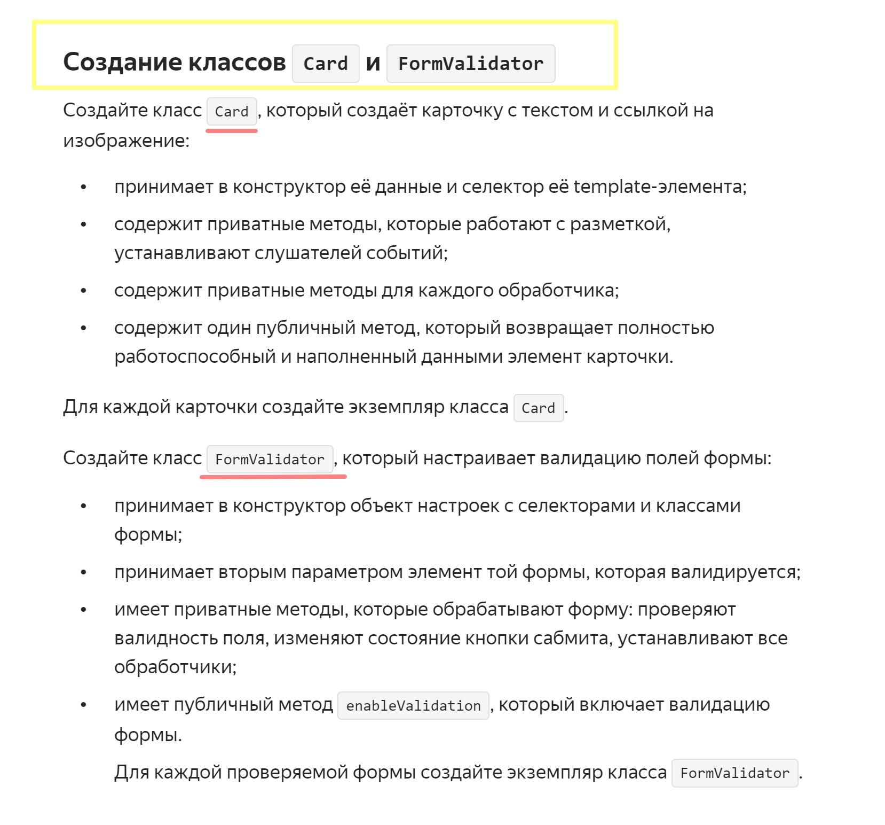

# Проект Mesto: Создание классов Card и FormValidator. Рефакторинг проекта.

### _Учебный проект от [Яндекс.Практикум](https://practicum.yandex.ru/web/)_

## Описание проекта

Проект посвящен интерактивному сервису **"Mesto"** и создан в рамках прохождения 4-7 спринтов курса *Веб-разработчик*. Учебный проект, выполняемый в рамках программы в **Яндекс.Практикум** по учебному курсу _web-разработчик_. В этой части проекта реализована функционал ***ООП*** и разбиение на модули, а также произведён ***рефакторинг*** кода, который за время выполнения проекта разрастался и его нужно было организовать. На основе полученных на курсе знаний о *классах*, переписал некоторые части кода.

## Функционал:

- Масштабирование изображений при изменении разрешения страницы
- Методология БЭМ
- Фйловая структура Nested БЭМ
- Верстка с применением Grids Layout
- Адаптивный дизайн с помощью директив @media
- Умение работать с макетом в Figma
- JavaScript открытие и закрытие попапа. Написание части логики на JS
- Popup - для редактирования информации в профиле
- Валидация форм для *"Редактировать профиль"* и *"Новое место"*. В данной задаче была реализована проверка на заполнение формы. Были использованы браузерные тексты ошибок.
- Реализовано закрытие ***Popup*** при нажатии на клавишу *'Escape'* при помощи события *keydown*
- В настоящий момент в проектной работе с готовой функциональностью произведён рефакторинг кода.
- Создан класс ***Card*** для создания карточки с текстом и ссылкой на изображение.
- Создан класс ***FormValidator*** для настройки валидации полей формы.
- Каждый из этих классов выполняет строго одну задачу и решение её находится внутри этого класса.
- Также в этой проектной работе было произведени разбитие JavaScript на модули и созданы три js - файла
        1. *Card.js* с кодом класса *Card*
        2. *FormValidator.js* с кодом класса *FormValidator*
        3. *index.js* со всем остальным кодом.
**Figma**

- [Ссылка на макет в Figma](https://www.figma.com/file/kRVLKwYG3d1HGLvh7JFWRT/JavaScript.-Sprint-6?node-id=0%3A1)

**Картинка из проекта**

## Ссылка на сайт:

*https://zdarovzibrov.github.io/mesto/*
